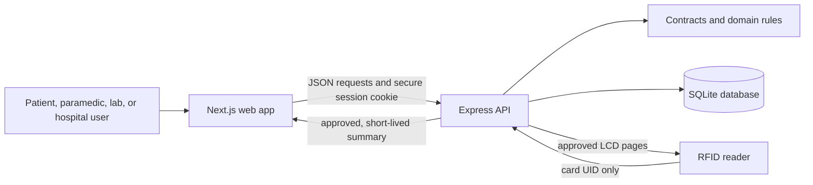

# Pran Rekha codebase, explained like a story

## The one-minute explanation

Pran Rekha is a **fictional healthcare-record demonstration** made for a hackathon. It is not a real hospital system and must not be used to make medical decisions.

Imagine a school nurse keeps a folder for each child:

- Every fact in the folder says **who wrote it** and **where it came from**.
- The child chooses which pages may be shown in an emergency.
- A paramedic can use an RFID card or QR-like locator to find the right folder, but cannot immediately read it.
- The paramedic must say why access is needed and receive a short-lived digital key.
- The hospital receives only the pages the patient approved.
- Every time somebody looks, the system writes a receipt.

That is the big idea behind this repository.

The project also demonstrates document uploads, local handwriting reading, face-based candidate suggestions, encrypted offline copies, signed records, medication history, and two RFID hardware designs. All included people and medical details are synthetic.

## The most important safety sentence

This app stores and displays **evidence**, not medical truth.

For example, it may say, “A document recorded blood group O-.” It should not say, “The patient is definitely O- and you should transfuse this blood.” Real clinicians must still verify the information and follow their normal procedures.

## The project as a little town

Think of the codebase as a small town:

| Town building | Code folder | Job |
|---|---|---|
| The front desk | `apps/web` | Shows screens and collects button clicks |
| The town hall | `server` | Checks identity, permissions, rules, and writes data |
| The rulebook | `packages/contracts` | Defines exactly what valid data looks like |
| The careful judge | `packages/domain` | Decides evidence labels and medication states |
| The filing cabinet | SQLite in `.data` | Keeps accounts, records, sessions, receipts, and demo objects |
| The card reader | `firmware` | Reads RFID cards and talks to the server |
| The inspectors | `tests` | Try normal and naughty actions to make sure rules hold |
| The setup helpers | `scripts` | Start phone demos, simulate scans, and enroll demo cards |

## How the pieces talk



The browser never gets to decide, “I am a doctor” or “I may read this patient.” The server makes those decisions from the logged-in account and stored relationships.

## The four main portals

The root page redirects to `/patient`. Four tiny Next.js page files all load the same large `Portal` component with a different portal name.

### Patient portal

The patient can:

- see their synthetic profile and source-attributed entries;
- choose exactly which entries may appear in an emergency summary;
- revoke that emergency release;
- add a clearly marked, unverified personal report;
- inspect access receipts;
- book a simulated discounted checkup;
- import a document and confirm text from it;
- report whether they are taking a recorded medicine;
- prepare an encrypted offline copy.

The patient cannot turn their own statement into a clinician-signed fact. Patient reports remain visibly separate.

### Paramedic portal

The paramedic can:

- read a recent scan from their paired RFID reader;
- resolve an opaque locator entered from a QR code or by hand;
- create a short-lived linkage to a candidate patient;
- state an emergency purpose and confirm the patient linkage;
- request a ten-minute grant;
- open only the patient-approved emergency summary;
- send a pre-arrival alert to the demo hospital;
- request a separately approved five-minute “break glass” grant.

A face result is only a candidate suggestion. It does not unlock a record.

### Hospital portal

Hospital staff can:

- register a synthetic patient, account, RFID tag, and optional face photo;
- add or replace a stored demo face enrollment;
- use local face matching to suggest possible patients;
- review and sign handwritten-note candidates;
- receive incoming paramedic alerts;
- move an alert from `EN_ROUTE` to `ARRIVED` to `RESOLVED`;
- approve a different staff member's break-glass request.

Incoming alerts update through Server-Sent Events. The event itself contains no patient data; it merely tells the browser to fetch fresh, permission-checked data.

### Lab portal

Lab staff can:

- view an assigned patient;
- add a signed clinical entry;
- review local OCR results from a handwritten page and sign selected lines;
- inspect signed version history;
- see a fake revenue ledger for the hackathon business-model demo.

No actual payment happens.

## A complete emergency journey

Here is the core story from card tap to hospital arrival:

1. The RFID device reads a card's UID, such as `DEADBEEF`.
2. It sends only the device ID, event ID, and card UID to the API.
3. The API authenticates the reader and remembers the scan. It returns no medical data.
4. The paramedic portal asks for the newest scan from its paired reader.
5. The API creates a two-minute patient linkage candidate.
6. The paramedic confirms the linkage and explains the purpose.
7. The API creates a grant lasting ten minutes and binds it to that exact login session.
8. The API builds a card containing only entry IDs in the patient's current emergency release.
9. The read is recorded as a receipt. If receipt writing fails, the medical view fails too.
10. If the linkage came from RFID, the little LCD may show the approved summary for only 90 seconds.
11. The paramedic can dispatch the approved summary to the demo hospital.
12. The hospital sees it only while the original grant and release revision are still valid.

If the patient revokes or changes the release, an old grant cannot silently grow into the new scope. A new card tap also cannot reuse the previous card's authorization.

## The rulebook: shared contracts

`packages/contracts` uses Zod schemas. A schema is like a shape sorter for data: a star-shaped block cannot go through the square hole.

The contracts define:

- IDs, timestamps, dates, roles, and demo-data modes;
- exact source pointers into text, images, or attestations;
- claims such as allergies, conditions, procedures, lab results, and contacts;
- medication records and medication events;
- evidence labels and API error shapes;
- signed clinical entries and profile versions;
- RFID scans, grants, emergency cards, dispatch alerts, registration, faces, and handwritten updates.

Important validation examples:

- A full timestamp must include an offset.
- A year-only date may not pretend to know a month and day.
- A text source range must end after it starts.
- An image box must remain inside the page.
- An RFID UID must have 8, 14, or 20 hexadecimal characters.
- A face descriptor must contain exactly 128 numbers.
- A registration may include both a face photo and descriptor, or neither—not only one.

## The judge: domain logic

`packages/domain` contains pure rules that do not know about web pages or databases.

### Source checking

`validateSourceReference` checks that a claim points to:

- the correct patient;
- the exact document ID and version;
- the exact SHA-256 fingerprint;
- a real page and valid text range.

This is like checking that a quotation really came from the claimed edition and page of a book.

### Evidence labels

`classifyEvidence` follows a cautious order:

1. Unauthorized information is hidden.
2. A broken source link is an error.
3. Conflicting evidence is labeled `CONFLICT`.
4. Old, stopped, held, or superseded medicine is labeled historical/held.
5. Missing context is labeled incomplete.
6. Two reviewed independent sources can be called corroborated.
7. Otherwise it is simply a recorded claim.

### Medication state

Medicine is stored as a record plus a timeline of events such as started, held, resumed, stopped, or completed.

The code deliberately distinguishes:

- “a prescription says active” from “the patient is definitely taking it”;
- the date an event happened from the date it was uploaded;
- a passed course end from proof that a person stopped;
- two contradictory same-day instructions from a trustworthy final answer.

There are currently two medication derivation paths:

- `derivePrescriptionView` serves the older G0 timeline API.
- `lifecycle` serves the newer multi-portal platform and additionally supports corrections, retractions, dose changes, substitutions, and stricter event linking.

## The server

The Express server listens on `127.0.0.1:4100`. Next.js runs on port `5173` and rewrites `/api/...` calls to it.

### Login and sessions

- Passwords are hashed with `scrypt` and a salt.
- A successful login creates a random 32-byte token.
- Only the token's SHA-256 hash is stored in SQLite.
- The raw token is placed in an HTTP-only, same-site cookie for eight hours.
- Login attempts are limited in memory to 20 per IP per minute.
- State-changing requests reject unexpected or cross-site origins.

The rate limiter resets when the server restarts and would not coordinate between multiple server machines. That is acceptable for this local demo, not for a production deployment.

### Authorization

The app uses several server-owned relationships:

- an account can be bound to its own patient;
- a lab or hospital worker can be assigned a patient;
- a staff account has a stored role, facility, unit, and optional paired reader;
- an emergency grant belongs to one actor, one session, one patient, one release revision, and one expiry time.

Forbidden and missing records intentionally look similar to callers. This makes it harder to guess whether another patient's ID exists.

### Integrity and signatures

The demo creates an Ed25519 facility key pair. Clinician-confirmed versions are signed over a canonical, consistently ordered JSON representation.

Before releasing a profile, the server verifies:

- every signed version has a valid signature from the trusted demo key;
- every entry marked reviewed appears unchanged in a signed version.

This proves that demo data was not changed after signing. It does not prove that the signer is a real accredited clinician.

### Safe repeated requests

Mutations use a `requestId`. The server stores a fingerprint of the request and its result.

- Sending the same request again returns the original result.
- Reusing the ID with different content causes a conflict.

This prevents a shaky phone connection from creating two bookings, two records, or two dispatches.

### API groups

| Group | What it does |
|---|---|
| `/api/session` | Sign in, inspect the current session, or sign out |
| `/api/patients/...` | Serve the older source-linked timeline and prescription view |
| `/api/documents/.../preview` | Serve an authorized exact source version |
| `/api/platform/context` | Return server-derived role and visible patient list |
| `/api/platform/profiles/...` | Read profiles; sign, release, revoke, report, book, snapshot, upload, or add medicine |
| `/api/platform/rfid/...` | Accept authenticated device scans, poll reader state, and briefly display an approved card |
| `/api/platform/linkage`, `/grants`, `/cards` | Turn a candidate into a short-lived approved view |
| `/api/platform/dispatch`, `/alerts/...`, `/events` | Send and update hospital arrivals |
| `/api/platform/faces...` | Store and retrieve hospital-only demo enrollments |
| `/api/platform/break-glass...` | Request and separately approve exceptional access |
| `/api/platform/offline...` | Check revocation and upload offline access receipts |
| `/api/platform/readers...`, `/tags` | Admin provisioning and revocation |

## Storage: two filing systems in one database

The project uses Node 24's built-in SQLite module with foreign keys and write-ahead logging.

The older G0 slice uses normal relational tables:

- `patients`
- `actors`
- `actor_patient_bindings`
- `sessions`
- `documents`
- `claims`
- `medications`
- `medication_events`

The newer platform adds:

- `portal_roles` for staff role and location;
- `platform_objects`, a general box holding JSON objects by `kind` and `id`;
- `platform_receipts` for the audit trail;
- `platform_requests` for idempotent mutation results.

This hybrid design is quick for a hackathon, but a production system would normally give major objects their own strongly constrained tables and migrations.

Transactions use `BEGIN IMMEDIATE`, then either commit everything or roll everything back. It is the database version of “all puzzle pieces go into the box, or none do.”

## The two demo worlds

The repository contains two connected but different demonstrations:

1. The older G0 API is seeded with Maya Shrestha, an exact allergy quotation, and a metformin prescription. `apps/web/src/App.tsx` is its React UI, but it is not mounted by the current Next.js routes.
2. The current portal UI is seeded by `PlatformStore` with Siddharth Raj Sharma plus patient, paramedic, hospital, lab, approver, and admin accounts.

The current Next.js routes use the second world. The older endpoints and tests still exist. This also explains why parts of `readme.md` describe an earlier feature set and call the frontend “React and Vite” even though the active app is Next.js 16.

## Document intake and handwriting OCR

There are two related paths.

### Uploaded documents

Patients may upload a JPEG, PNG, or text PDF up to 10 MiB, with at most ten pages/documents per configured checks.

The server:

- checks magic bytes instead of trusting the filename;
- rejects suspicious PDF actions such as JavaScript, launch actions, or embedded files;
- extracts PDF text with PDF.js;
- validates images with Sharp and limits pixel count;
- de-duplicates by content hash;
- stores the original privately;
- makes the user confirm a page, span, text, date, and category.

Image-only input becomes an attributed manual transcription. The system does not pretend that made-up OCR coordinates exist.

### Handwritten clinical notes

The browser performs the image work:

1. Convert the image to grayscale.
2. Normalize shadows and contrast.
3. Estimate and correct skew.
4. Find individual writing lines.
5. Run a handwriting-trained TrOCR model in a Web Worker.
6. Run bundled Tesseract as a second reader.
7. Score both answers using confidence and prescription-like language.
8. Suggest cautious corrections from a medical lexicon.
9. Suggest categories such as medication, allergy, vital, or condition.
10. Require a clinician to review, edit, select, and sign each line.

The raw OCR line and original JPEG are retained as evidence. OCR is never silently promoted to a clinical fact.

TrOCR model weights are downloaded from Hugging Face on first use; Tesseract worker/core/language assets are bundled under `public/tesseract`.

## Face matching

The browser loads bundled face detector, landmark, and recognition models. It requires exactly one clear face and turns it into a 128-number descriptor.

Matching uses Euclidean distance with a threshold of `0.5`:

- no close result becomes `NO_MATCH`;
- one to three close results become ordered candidates;
- more than three becomes `AMBIGUOUS`;
- a model failure becomes `UNAVAILABLE`.

Distances are never shown. A result contains only handles, labels, and patient IDs. Consent is required before matching.

The code supports session-only enrollments that disappear on page exit. The hackathon registration workflow also intentionally stores consented demo photos and descriptors in SQLite so the hospital can find registered demo patients later. The UI and comments clearly mark this deviation.

## Offline mode

The service worker caches only the app shell, static assets, models, and navigation responses. It deliberately never caches `/api/` responses.

When a patient prepares an offline snapshot:

- the server builds only the currently approved emergency card;
- it binds the snapshot to a browser-generated device ID;
- it expires after eight hours;
- it signs the snapshot with Ed25519;
- the browser derives an AES-256-GCM key from a 12+ character phrase using PBKDF2-SHA-256 with 310,000 iterations;
- the encrypted snapshot is stored in IndexedDB.

On unlock, the browser checks the phrase, clock rollback, expiry, device binding, known revocation, and signature before displaying anything. It records a local access receipt first and uploads queued receipts when online again.

An offline device cannot learn about a new revocation until it reconnects, so the UI warns that later changes may be unavailable.

## RFID hardware

The repository supports two approaches.

### ESP32 + RC522

`firmware/rc522` is a self-contained Wi-Fi reader:

- reads a card UID;
- creates a random event ID;
- sends it over HTTPS with a device bearer token;
- validates the server through a configured CA certificate;
- retries temporary failures using the same event ID;
- stores no patient data.

### Arduino Uno + Raspberry Pi bridge + LCD

`firmware/uno_scanner` reads an RC522 card and controls a 16x2 LCD. It speaks a tiny serial language:

- `PING` asks for hardware status;
- `CLEAR` resets the screen;
- `LCD<TAB>line 1<TAB>line 2` displays text;
- `SCAN<TAB>UID` reports a card.

The Uno removes duplicate rapid taps and clears patient text after eight seconds.

`firmware/pi_bridge/scanner.py` runs on a Raspberry Pi. It:

- reconnects when USB is unplugged;
- accepts HTTPS, or loopback HTTP through a tunnel;
- authenticates the reader to the API;
- retries scans safely;
- polls for approval;
- paginates complete fields onto the tiny LCD instead of silently cutting off an allergy or name;
- replaces unsupported characters or tells the operator to read the app;
- clears data after expiry or failure.

## Frontend details

- Next.js App Router supplies routes and metadata.
- React 19 renders the interactive client portal.
- Zustand remembers language and an explicitly selected dark theme.
- English and draft Nepali labels are available; the footer says native-speaker review is pending.
- Radix Dialog displays source evidence accessibly.
- Lucide supplies icons.
- QRCode makes the opaque locator image.
- The manifest and service worker make the project installable as a PWA.
- CSS files implement responsive layouts, cards, warnings, portal boards, and dark mode.

## Important files, one by one

### Root

| File | Plain-English purpose |
|---|---|
| `package.json` | Defines the npm workspaces and commands for development, build, tests, seeding, reset, phone mode, and RFID simulation |
| `package-lock.json` | Freezes exact package versions |
| `tsconfig.base.json` | Enables strict TypeScript safety rules for every workspace |
| `vitest.config.ts` | Runs Node-based unit and integration tests |
| `playwright.config.ts` | Runs browser tests against a disposable SQLite database |
| `readme.md` | Quick-start guide; some workspace/feature wording reflects the older G0 stage |
| `health_plan.md` | Detailed product, safety, privacy, and implementation plan |
| `pranrekha_system_specification.txt` | Original full-stack product specification |
| `plans.md` | Combined delivery decisions and stage checklist |
| `fixtures/FIXTURE_MANIFEST.md` | Describes frozen fake fixtures |
| `fixtures/documents/synthetic-discharge.txt` | Exact fake document used by source-link tests |

### Shared packages

| File | Purpose |
|---|---|
| `packages/contracts/src/index.ts` | Older G0 schemas for claims, sources, medicines, sessions, and responses |
| `packages/contracts/src/platform.ts` | Newer portal schemas for profiles, releases, cards, faces, handwriting, scans, and alerts |
| `packages/domain/src/index.ts` | Source validation, evidence classification, and G0 prescription derivation |
| `packages/domain/src/lifecycle.ts` | Rich event-based medication lifecycle logic |

### Server

| File | Purpose |
|---|---|
| `server/src/index.ts` | Opens/initializes the database, starts the API, and shuts down cleanly |
| `server/src/app.ts` | Security middleware, sessions, old G0 endpoints, and mounting of the platform router |
| `server/src/storage/database.ts` | Opens SQLite, finds the migration, and provides transactions |
| `server/src/storage/migrations/001_initial.sql` | Creates the core relational tables and indexes |
| `server/src/storage/repository.ts` | Reads typed G0 data from relational tables |
| `server/src/storage/seed.ts` | Creates Maya's frozen G0 demo and password hashes |
| `server/src/storage/demo-paths.ts` | Prevents reset code from targeting any database except the named demo file |
| `server/src/storage/seed-cli.ts` | Command-line demo seeding entry point |
| `server/src/storage/reset-cli.ts` | Safely removes only marked demo SQLite files |
| `server/src/platform/store.ts` | Generic platform object store, receipts, request replay protection, signatures, and Siddharth demo seed |
| `server/src/platform/routes.ts` | Main profiles, RFID, release, face, dispatch, alerts, booking, ledger, and offline routes |
| `server/src/platform/intake.ts` | Safe PDF/image import and confirmation |
| `server/src/platform/medications.ts` | Medication creation, lifecycle events, and use reports |
| `server/src/platform/operations.ts` | Reader/tag administration, break-glass approval, and offline revocation checks |
| `server/src/platform/fixtures.ts` | Seeds demo medication cases |
| `server/src/platform/enroll-demo-batch.ts` | Atomically turns seven named RFID cards into fictional demo patients |

### Web app

| File | Purpose |
|---|---|
| `apps/web/src/app/layout.tsx` | Global metadata, fonts, CSS, and early dark-theme setup |
| `apps/web/src/app/manifest.ts` | PWA name, icons, colors, start page, and shortcuts |
| `apps/web/src/app/*/page.tsx` | Very small route entry points for the four portals |
| `apps/web/src/platform/Portal.tsx` | Main role-aware UI and most user journeys |
| `apps/web/src/platform/client.ts` | Fetch helper, preferences, translations, and request IDs |
| `apps/web/src/platform/Workflows.tsx` | Document, medication, use-report, and break-glass forms |
| `apps/web/src/platform/RegisterPatient.tsx` | Hospital registration, optional face data, and locator QR |
| `apps/web/src/platform/EnrollFace.tsx` | Add/update a face for an existing demo patient |
| `apps/web/src/platform/FaceLookup.tsx` | Consent-gated local matching UI |
| `apps/web/src/platform/PhotoCapture.tsx` | Camera/upload component with careful stream and URL cleanup |
| `apps/web/src/platform/face.ts` | Face model loading, description, distance, and cautious result states |
| `apps/web/src/platform/HandwrittenUpdate.tsx` | OCR review and clinician signing screen |
| `apps/web/src/platform/ocr.ts` | Coordinates preprocessing, TrOCR, Tesseract, and winner selection |
| `apps/web/src/platform/ocr.worker.ts` | Runs the handwriting model away from the main UI thread |
| `apps/web/src/platform/ocr-image.ts` | Pure grayscale, shadow, threshold, skew, and line-segmentation math |
| `apps/web/src/platform/medical-lexicon.ts` | Corrects likely drug/unit OCR mistakes and scores plausibility |
| `apps/web/src/platform/categorize.ts` | Suggests a record type from keywords while keeping the raw line |
| `apps/web/src/platform/offline.ts` | Encryption, signature checks, IndexedDB vault, and receipt syncing |
| `apps/web/public/sw.js` | Offline shell cache that excludes API data |
| `apps/web/src/App.tsx` and `apps/web/src/api.ts` | Older G0 dashboard/client; retained but not used by current Next.js pages |
| `apps/web/src/styles.css` and `platform/portal.css` | Visual design, responsiveness, portal widgets, and dark mode |

### Scripts, firmware, and assets

| Path | Purpose |
|---|---|
| `scripts/simulate-rfid.mjs` | Sends one authenticated fake card scan |
| `scripts/capture-rfid-cards.mjs` | Collects seven physical cards in first-seen order without assigning patients yet |
| `scripts/enroll-demo-batch.ts` | Generates private passwords first, then atomically registers a named seven-card batch |
| `scripts/phone.mjs` | Builds the app, opens a temporary Cloudflare HTTPS tunnel, starts both servers, and prints a QR code |
| `apps/web/scripts/generate-icons.mjs` | Rebuilds PWA icons from source artwork |
| `firmware/rc522` | ESP32 Wi-Fi reader implementation |
| `firmware/uno_scanner` | Arduino reader and LCD implementation |
| `firmware/pi_bridge` | Raspberry Pi serial-to-API bridge, service file, and tests |
| `docs/RFID.md`, `docs/RFID_UNO.md`, `docs/DEVICE_MATRIX.md` | Hardware setup and supported-device notes |
| `docs/ASSET_LICENSES.md` | Asset licensing information |
| `images`, `apps/web/assets`, `apps/web/public/brand`, `apps/web/public/icons` | Logos and generated app artwork |
| `apps/web/public/models` | Bundled face-model weights |
| `apps/web/public/tesseract` | Bundled Tesseract runtime and English language data |

## What the tests protect

Vitest covers the rule and API layers. Playwright drives real browser portals. Python tests cover the Pi bridge.

The tests specifically check:

- exact source spans and cross-patient rejection;
- cautious evidence ordering;
- medication states, conflicts, course ends, corrections, and retractions;
- role forgery and unassigned-clinician denial;
- identical denial shapes for missing and forbidden records;
- allowed-origin checks;
- authenticated and deduplicated RFID scans;
- LCD approval, expiry, logout, release change, new-card isolation, and failed auditing;
- grant expiry, revocation, session binding, and break-glass two-person approval;
- signed-record tamper detection;
- private originals and attributed transcriptions;
- patient registration, duplicate protection, optional/later face enrollment, and seven-card atomic enrollment;
- offline encryption, wrong phrases, expiry, signature tampering, receipts, and offline reload;
- face candidate-only results;
- OCR image segmentation, shadows, touching lines, blank pages, skew, lexicon fixes, and categorization;
- light/dark theme behavior and key end-to-end portal journeys.

## How to run it

Requirements: Node.js 24+ and npm 11+.

```powershell
rtk npm install
rtk npm run demo:seed
rtk npm run dev
```

Then open `http://localhost:5173`.

Useful demo accounts include:

| Portal | Username | Password |
|---|---|---|
| Current patient portal | `siddharth` | `pran-demo-siddharth` |
| Paramedic | `paramedic` | `pran-demo-paramedic` |
| Hospital | `hospital` | `pran-demo-hospital` |
| Lab | `lab` | `pran-demo-lab` |
| Break-glass approver | `approver` | `pran-demo-approver` |
| Older G0 API/UI data | `maya.patient` | `pran-demo-patient` |

Verification commands:

```powershell
rtk npm run typecheck
rtk npm run test
rtk npm run build
rtk npm run test:e2e
```

## Honest limitations

This is a thoughtful hackathon prototype, not a production clinical system.

- All data and credentials are demo data.
- The facility signing key is stored in the same demo database, not a secure key service.
- Face photos may persist for the demo workflow.
- The generic JSON object table has fewer database-level rules than dedicated tables would.
- The app has two generations of APIs, seed patients, and medication logic.
- The old `App.tsx` is not connected to the current Next.js pages.
- Some README statements describe the earlier G0 stage and are now out of date.
- The login limiter is only in one process's memory.
- No production backup, disaster recovery, key rotation, regulatory validation, clinical governance, or real identity proofing is implemented.
- Nepali copy still needs native-speaker review, and verified Bikram Sambat conversion is intentionally unavailable.
- The Cloudflare quick tunnel is a demo convenience, not a production deployment plan.
- OCR and face matching can be wrong, so the design keeps them as human-reviewed suggestions.

## Tiny glossary

| Word | Kid-friendly meaning |
|---|---|
| API | A waiter carrying requests between the screen and the server |
| Schema | A rule-shaped cookie cutter for data |
| Hash | A one-way fingerprint of some data |
| Signature | A mathematical tamper-evident seal |
| Session | A temporary “you are signed in” pass |
| Grant | A smaller, short-lived key to one approved record view |
| Revision | A numbered version of something |
| Idempotent | Safe to repeat without accidentally doing it twice |
| Transaction | An all-or-nothing group of database changes |
| OCR | Software trying to read words from a picture |
| PWA | A website that can behave like an installed phone app |
| RFID | A card/tag that shares a small ID over radio when tapped |
| SSE | A simple open line where the server can say, “please refresh” |
| Provenance | The story of where information came from |

## If a kid remembers only five things

1. Pran Rekha is a pretend medical-record system for a demo.
2. Facts keep links to their sources instead of pretending to be unquestionable truth.
3. The patient chooses what may be shared in an emergency.
4. Every emergency key is narrow, temporary, checked by the server, and recorded.
5. Computers may suggest text or faces, but a human must confirm important decisions.
